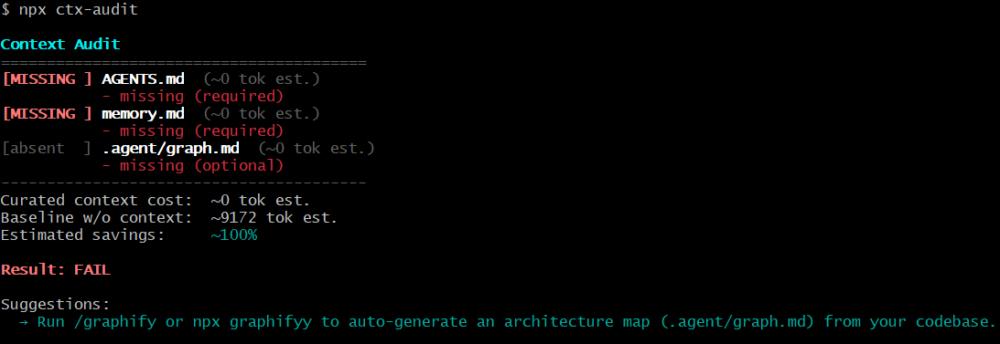

# ctx-audit

[](https://www.npmjs.com/package/ctx-audit)
[](https://www.npmjs.com/package/ctx-audit)
[](https://nodejs.org)
[](LICENSE)



ctx-audit is a repository memory governance tool for engineering teams working with AI coding agents.

It verifies that project context files (`AGENTS.md`, `memory.md`, `.agent/graph.md`) exist, stay aligned with the codebase, and remain a trustworthy source of truth — so agents can rely on curated knowledge instead of re-discovering architecture, conventions, and decisions from raw source on every session.

Zero dependencies, single script, three install paths.

## Why ctx-audit?

- **Decisions live in heads, not files.** Architectural choices, past experiments, and settled debates are invisible to agents unless they're written down and kept current.
- **Conventions are scattered.** Build rules, lint constraints, and naming patterns are buried in commits, PRs, and Slack threads — not in a place agents can read.
- **Agents re-scan everything.** Without fresh context files, every session starts from zero: the agent reads hundreds of source files to reconstruct what your team already knows.
- **Stale docs are worse than none.** An agent that trusts an outdated `AGENTS.md` will make wrong assumptions with false confidence.

## Before / After

| Without context files | With fresh context files |
|---|---|
| Agent reads hundreds of source files to understand structure | Agent reads curated `AGENTS.md` in seconds |
| Conventions must be re-derived from code patterns | Hard constraints and conventions are explicit and verified |
| Every session starts from zero | Decisions and rationale persist across sessions |
| Agent may contradict past decisions | `memory.md` provides a trusted decision log |

## What ctx-audit checks

### Repository Memory Health

Verifies required context files exist and follow the `last_synced_commit` frontmatter convention that pins each file to the commit it was last verified against.

### Context Freshness

Counts source commits since each file was last synced. Reports graduated staleness levels (`FRESH`, `STALE?`, `STALE!`, `STALE`) so you know exactly how much to trust each file before handing it to an agent.

Also detects **stale-bump**: a SHA update with no real content change — and **dead references**: paths mentioned in context files that no longer exist in the repo.

### Context Efficiency

Estimates how compact your curated context is compared to an agent reading raw source. Uses a ~3.5 chars/token heuristic — fast, dependency-free, and directionally useful, but not exact. All token counts in the output are labeled `est.` to make this clear. The "baseline" estimate sums tracked source files up to a cap, which is a proxy for "an agent reading everything," not a guarantee of what any particular agent would actually do.

The savings ratio (e.g., `12.0x smaller`) shows how much more compact the curated context is compared to reading raw source.

## Supported Agent Ecosystem

| Agent | How to integrate |
|---|---|
| Claude Code | `npx ctx-audit install` — registers `/ctx-audit` skill and session trigger |
| OpenAI Codex | Add `npx ctx-audit --strict` to your CI workflow |
| Cursor | Add ctx-audit to your `.cursorrules` session preamble |
| Gemini CLI | Reference `AGENTS.md` in your system prompt |
| Windsurf | Add ctx-audit to Windsurf's pre-session hooks |
| Aider | Pass `--read AGENTS.md` after verifying freshness |

## Philosophy

- Context files should be **explicit** — written down, not inferred from code patterns.
- Context files should be **version-controlled** — treated as first-class engineering artifacts alongside source.
- Context files should be **reviewable** — changes go through the same PR process as code.
- Context files should be **auditable** — every file carries the commit it was last verified against.
- Context files should be **trustworthy** — agents that trust their context are faster, more accurate, and less likely to contradict past decisions.

## Getting started in 60 seconds

```bash
# 1. Install skill into Claude Code + register trigger
npx ctx-audit install

# 2. Wire up a git pre-push guard
npx ctx-audit hook install

# 3. Tell agents in this repo to run it at session start
npx ctx-audit claude install

# 4. Scaffold AGENTS.md + memory.md (interactive — writes files to repo root)
npx ctx-audit init

# 5. Run your first audit
npx ctx-audit
```

## Install

### npx (no install)

```bash
npx ctx-audit
```

### Global install

```bash
npm i -g ctx-audit
ctx-audit
```

### Agent skill (skills.sh)

```bash
npx skills add aryashreep/ctx-audit --skill ctx-audit
```

### CI gate (GitHub Action)

```yaml
# .github/workflows/ctx-audit.yml
- uses: aryashreep/ctx-audit@v1
  with:
    strict: "true"   # exit 1 on failure (default)
    json: "false"     # JSON output (default: false)
```

Or copy `action/ctx-audit.yml` into `.github/workflows/` for the
standalone workflow approach.

## Subcommands

| Command | What it does |
|---|---|
| `ctx-audit init` | Scaffold `AGENTS.md` + `memory.md` into repo root (interactive); or print templates to stdout when piped |
| `ctx-audit install` | Copy skill to `~/.claude/skills/ctx-audit/`, register `/ctx-audit` trigger in `~/.claude/CLAUDE.md` |
| `ctx-audit hook install` | Append `npx ctx-audit --strict` to `.git/hooks/pre-push` (idempotent) |
| `ctx-audit hook uninstall` | Remove ctx-audit lines from pre-push hook |
| `ctx-audit hook status` | Check whether the hook is installed |
| `ctx-audit claude install` | Append a `## ctx-audit` section to project `CLAUDE.md` (idempotent) |
| `ctx-audit claude uninstall` | Remove the ctx-audit section from project `CLAUDE.md` |
| `ctx-audit benchmark` | Print token savings in a focused, shareable format |

## Flags

```bash
npx ctx-audit              # human-readable report (colored in TTY)
npx ctx-audit --json       # machine-readable JSON
npx ctx-audit --strict     # exit 1 on any failure (for CI)
npx ctx-audit --ci         # alias for --strict --json
npx ctx-audit --help       # show usage and exit
```

## Layout

```
ctx-audit/
├── package.json
├── action.yml              composite GitHub Action
├── scripts/audit.mjs       core logic (no dependencies, plain Node >=18)
├── SKILL.md                agent-invoked path (30+ trigger phrases)
├── action/ctx-audit.yml     CI workflow template (copy into target repo)
└── README.md
```

## Prompting (as a Claude Code skill)

Once installed as a skill (`ctx-audit install`), you can trigger ctx-audit with natural language:

| Prompt | What happens |
|---|---|
| "audit my context files" | Runs the audit, reports freshness |
| "check context" / "is this repo set up for agents?" | Same — triggers the skill |
| "get me up to speed on this repo" | Runs audit first, then reads the fresh files |
| "is my memory.md stale?" | Runs audit, focuses on staleness |
| "scaffold context files" / "init context" | Runs `ctx-audit init` to write templates |
| "benchmark token savings" | Runs `benchmark` subcommand |
| "add ctx-audit to CI" | Suggests hook install + CI workflow |

**When should an agent run it?** At the start of any non-trivial session — before
trusting claims in `AGENTS.md` or `memory.md` (a stale file is worse than none),
before doing a broad exploratory pass reading many files to understand structure,
and before re-deriving project conventions from scratch.

## Interpreting results

| Result | Meaning | Action |
|---|---|---|
| **MISSING** (required) | File doesn't exist | Run `npx ctx-audit init` to scaffold, then fill in TODOs |
| **FRESH** | Up to date | Trust the file, read it instead of scanning raw source |
| **STALE?** | Approaching threshold | Mild caution — spot-check critical claims |
| **STALE!** | Past threshold | Treat claims as unverified; update the file after your session |
| **STALE** | Significantly behind | Same as STALE! but more urgent |
| **Dead references** | Paths in context files point to deleted files | Update the references |
| **Over budget** | File token count exceeds `maxTokens` | Trim the file down |
| **SHA bumped but content unchanged** | Commit SHA updated without real edits | Review whether the file actually reflects recent changes |

## The convention

Three files, each opening with frontmatter pinning the commit it was last
verified against:

```markdown
---
last_synced_commit: <git sha>
---
```

- **AGENTS.md** — stable conventions: build/test/lint commands, layout
  rules, hard constraints. Changes rarely.
- **memory.md** — a decision log: what was tried, what was decided, why.
  Append-only in spirit; not a restatement of current code.
- **.agent/graph.md** (optional) — one paragraph per module: what it does,
  what it talks to. Not file contents, not a full tree.

Whenever you touch what one of these files claims, update its content *and*
its `last_synced_commit` to current HEAD.

## Configuration

Place `.ctx-audit.json` in the repo root. All fields are optional:

```jsonc
{
  "files": [
    { "id": "agents", "file": "AGENTS.md", "label": "Agent instructions", "maxTokens": 1500, "required": true },
    { "id": "memory", "file": "memory.md", "label": "Decision log", "maxTokens": 2500, "required": true }
  ],
  "sourceDirs": ["src", "packages/core"],
  "staleThreshold": 10,
  "baselineFileCap": 300
}
```

- **`files`** — replaces the default file list entirely (not merge). If you
  customize this, list all files you want audited.
- **`sourceDirs`** — directories treated as "real source" for staleness and
  baseline. When omitted, auto-detected from git tracked files (top 5 dirs
  by file count), falling back to `["src", "lib", "app"]`.
- **`staleThreshold`** — number of source commits before a file is considered
  stale. Default: `5`.
- **`baselineFileCap`** — max source files to tokenize for baseline estimate.
  Default: `200`.

## `watches:` frontmatter field

Scope staleness checks to specific paths instead of all source directories:

```markdown
---
last_synced_commit: abc1234
watches: src/auth/**, src/api/**
---
```

Comma-separated git pathspecs. When present, only commits touching those paths
count toward staleness, making the check more precise for files that document
a specific subsystem.

## Graduated staleness

Instead of binary stale/fresh, ctx-audit reports 4 levels:

| Level | Commits since sync | Display | Counts as failure? |
|---|---|---|---|
| `fresh` | 0 to threshold×0.5 | `[FRESH]` | No |
| `possibly-stale` | threshold×0.5 to threshold | `[STALE?]` | No |
| `likely-stale` | threshold to threshold×2 | `[STALE!]` | Yes |
| `stale` | >threshold×2 | `[STALE]` | Yes |

The JSON report includes both `stalenessLevel` (string) and `stale` (boolean)
for backward compatibility.

## Additional checks

- **Stale-bump detection:** If a file's body is identical at `last_synced_commit`
  vs. current HEAD but source commits exist, a warning is emitted: "SHA bumped
  but content unchanged." This catches mechanical SHA updates without real
  review. Warning only, not a failure.
- **Dead reference detection:** Backtick-quoted paths and bare `dir/file.ext`
  patterns in context files are checked against the filesystem. Missing paths
  are reported as warnings.

## `init` scaffolding

```bash
npx ctx-audit init         # interactive: writes AGENTS.md + memory.md to disk
npx ctx-audit init | cat   # piped: prints templates to stdout
```

Detects project info from `package.json`, `pyproject.toml`, `Cargo.toml`, or
`Makefile` and fills in build/test/lint commands. Always writes files to the
repository root, even when run from a subdirectory. In an interactive terminal
it writes files directly and asks before overwriting existing ones. When
piped or redirected it prints to stdout for backward compatibility.

> **Note:** The `--init` flag is still supported as a deprecated alias for
> `npx ctx-audit init` and will not be removed.

## Companion tools

**Graphify** (`/graphify` in Claude Code, or `npx graphifyy` standalone) can
auto-generate the `.agent/graph.md` architecture map by building a knowledge
graph from your codebase. When ctx-audit reports high baseline token costs or a
missing graph file, running Graphify is the fastest way to close the gap.

